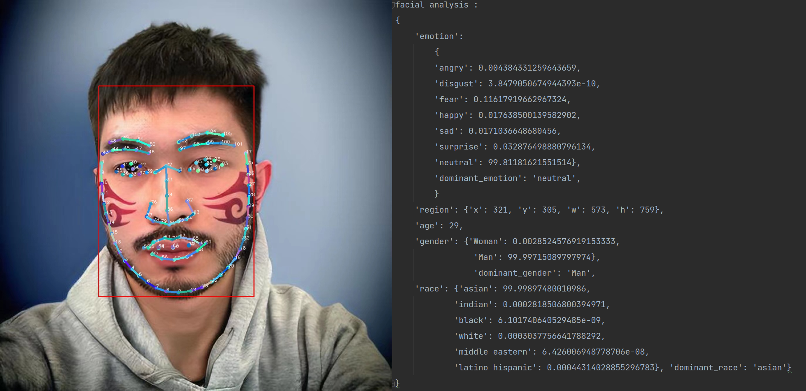

<!-- PROJECT LOGO -->
 

  

<h3 align="center">loo Dev Doc</h3>

<!-- TABLE OF CONTENTS -->
## Description
This is a tool project for domain developer with ubuntu

## Features

- conda mirror
- conda configure
- static ip configure for local network
- git server command regularly used
- linux problem solve
- mount and unmount disk permanently
- nvidia-driver-drop-solver
- pypi mirror source
- network proxy
- venv clone

## Usage

check the *.md / *.txt files
